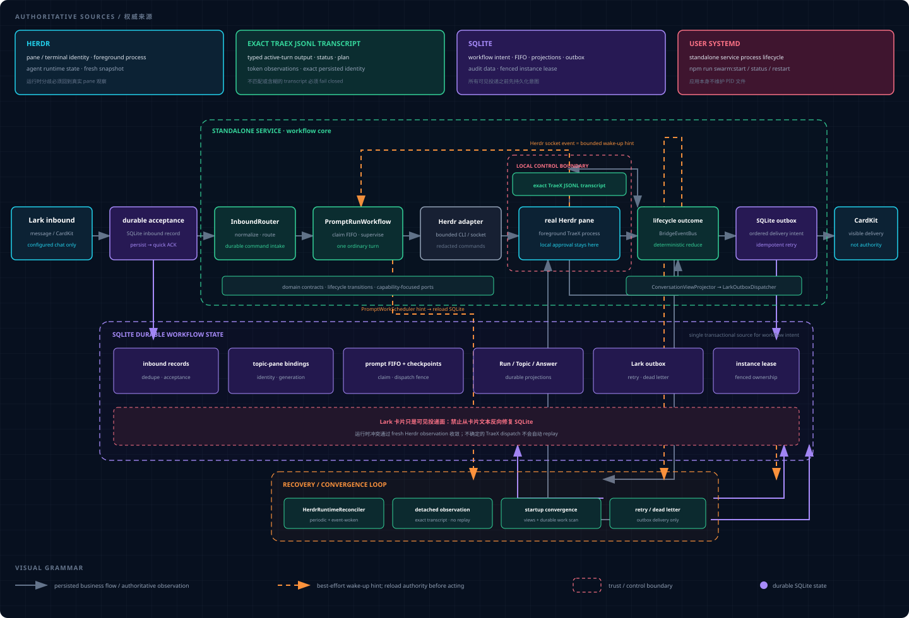

# Herdr Agent Swarm

Herdr Agent Swarm is a durable, human-controlled multi-agent coordinator for
[Herdr](https://github.com/zhufaris/herdr). It connects a configured Lark group
to real Agent processes in Herdr panes, keeps workflow state in SQLite, and
publishes progress and answers as Lark CardKit cards.

Version 0.4.0 supports one standalone service, managed by user systemd. The
former compatibility plugin is not an installation or operation surface.

## What it provides

- Project-scoped Primary sessions and explicitly created Worker sessions.
- Selectable TraeX, Pi, Codex, or Claude Code Primary sessions, with TraeX as
  the default, plus the same four Agent kinds for Workers.
- One durable FIFO per binding or Worker, with exact-turn steering and stopping.
- Restart recovery that observes uncertain work without automatically replaying
  prompts that may already have reached an Agent.
- Durable CardKit projections and an idempotent SQLite outbox for Lark delivery.
- Multiple configured projects with strict workspace and working-directory routes.
- Loopback health, readiness, and safe operational status endpoints.

## System architecture

The request path is:

~~~text
Lark message or card action
  -> validated, authorized inbound record
  -> durable workflow acceptance and FIFO claim
  -> fenced Herdr / Agent effect
  -> authoritative runtime observation
  -> durable view and outbox intent
  -> ordered CardKit delivery
~~~

The system deliberately splits authority:

| Authority | Owns |
| --- | --- |
| Herdr | Live pane identity, terminal identity, foreground process, and Agent state |
| SQLite | Bindings, prompt FIFO, Worker turns, delivery intent, audit data, and the fenced instance lease |
| Lark | Visible cards and messages only |
| user systemd | The standalone service process |

Socket events and process-local notifications reduce latency, but reconciliation
against fresh Herdr state is the convergence path. Workflow intent is persisted
before Lark delivery, so a delivery retry never repeats an Agent prompt.

Open the [interactive architecture diagram](docs/herdr-agent-swarm-architecture.html)
for an explorable view. See [Architecture](docs/architecture.md) for lifecycle,
durability, and recovery semantics, or the
[architecture reference](docs/architecture-reference.md) for a maintainer-focused
module map.

## Security model

An authorized Lark user can cause an Agent process to act with the permissions
of the service account. Deploy this service only in a dedicated, tightly scoped
group and on an isolated VM, container, or non-critical host with a
least-privilege account.

The gateway accepts only user-originated messages and card actions from the
configured chat and allowlisted Open IDs. Administrative actions require an ID
listed in `LARK_ALLOWED_OPEN_IDS` and `LARK_ADMIN_OPEN_IDS`.

TraeX defaults to `TRAEX_PERMISSION_MODE=auto`. High-risk approval stays in
the local Herdr pane: the Lark bridge cannot remotely approve or deny a request,
send arbitrary terminal input, or kill a process or pane. Use
`bypass_permissions` only after explicitly accepting that every allowed chat
member can act as the host account.

Logs, command errors, and terminal output pass through bounded redaction, but
redaction is best-effort. Never place credentials in prompts, project files, or
tracked configuration.

## Prerequisites

- Linux with Node.js 22.12 or newer; Node.js 24 LTS is recommended.
- npm and user systemd.
- Herdr 0.7.5 or newer, with a running workspace.
- `herdr`, `traex`, and any optional Primary or Worker CLIs you intend to use
  (`codex`, `claude`, or `pi`) available to the service account.
- A published Lark custom app with bot capability and long-connection event delivery.
- A topic-enabled Lark group containing the bot.

The Lark app must subscribe to `im.message.receive_v1` and
`card.action.trigger`, and have permission to read group messages, send and
reply to messages, manage interactive cards, and read message/thread metadata.
Record the app ID, app secret, chat ID, bot Open ID, allowed user Open IDs, and
administrator Open IDs for setup.

## Install from source

Clone the repository and verify the host tools:

~~~bash
git clone git@github.com:zhufaris/herdr-agent-swarm.git
cd herdr-agent-swarm
node --version
npm --version
herdr --version
traex --version
herdr status server
~~~

Install the locked dependencies, build the project, and run guided setup:

~~~bash
npm ci
npm run build
npm run swarm:setup
~~~

The setup wizard performs read-only checks for Lark, Herdr, the selected project
route, local executables, user systemd, and the loopback port. It shows a
redacted preview before writing private configuration. Setup may separately offer to
install and then start or restart the service. For this explicit installation
sequence, decline setup's optional install and start or restart prompts.

Build and stage an immutable release, enable the user unit, start it, and inspect
its status:

~~~bash
./install.sh
npm run swarm:start
npm run swarm:status
~~~

Installation enables the unit but deliberately does not start it. Configuration
is stored under `~/.config/herdr-agent-swarm` and state under
`~/.local/state/herdr-agent-swarm` unless XDG or Swarm-specific overrides are
set. The generated environment, project registry, runtime tuning, database, and
logs are private runtime data and must not be committed.

Confirm readiness on the configured loopback port:

~~~bash
curl -fsS http://127.0.0.1:8787/ready
~~~

The response must contain `"status":"ready"`. If setup selected another
`BRIDGE_HTTP_PORT`, use that port.

Herdr events drive low-latency convergence. `RECONCILE_INTERVAL_MS` controls the
periodic full recovery scan, accepts 5,000 through 3,600,000 milliseconds, and
defaults to 30,000. The shipped environment example uses a five-minute scan.

### Update a source installation

Update to the intended committed revision, rebuild, and install another immutable
release:

~~~bash
git pull --ff-only
npm ci
npm run build
./install.sh
npm run swarm:status
npm run swarm:restart
~~~

Inspect status before restarting. The ordinary restart refuses to interrupt
running or queued prompts, active Worker work, or pending delivery. Prefer to
let the work drain. When an intentional observer handoff is required:

~~~bash
npm run swarm:restart -- --force
~~~

A forced restart detaches observers and recovers durable work without replay;
it does not bypass identity fences or workload correctness checks.

## Install from a GitHub Release

Tagged releases contain a prebuilt Linux x64 archive and `SHA256SUMS`. The
archive includes compiled JavaScript and locked production dependencies. The
target still needs Node.js 22.12 or newer, Herdr, at least one supported Agent
CLI, and user systemd.

Download both files from the GitHub Release, then verify and extract them:

~~~bash
sha256sum --check SHA256SUMS
tar -xzf herdr-agent-swarm-0.4.0-linux-x64.tar.gz
cd herdr-agent-swarm-0.4.0-linux-x64
npm run swarm:setup
./install.sh
npm run swarm:start
npm run swarm:status
~~~

Replace `0.4.0` with the downloaded version. The packaged installer stages
the prebuilt release and retains existing configuration and state.

## Install as a standalone service

The standalone user-systemd service is the only supported deployment identity.
The setup wizard writes private files only after validation and confirmation:

- `.env` contains credentials and process settings.
- `projects.json` maps public project IDs to exact Herdr workspaces and
  absolute working directories.
- `runtime.yaml` contains polling, caching, CardKit, and pane-retention tuning.

Templates are available in [`.env.example`](.env.example),
[`projects.example.json`](config/projects.example.json), and
[`runtime.example.yaml`](config/runtime.example.yaml). Validate manually
edited files before installing:

~~~bash
npm run config:validate -- ~/.config/herdr-agent-swarm/.env \
  ~/.config/herdr-agent-swarm/projects.json
~~~

The supported lifecycle commands are:

~~~bash
npm run swarm:start
npm run swarm:status
npm run swarm:restart
npm run swarm:stop
npm run swarm:logs
~~~

Run `npm run swarm:doctor` for read-only environment diagnosis. The service
log is private, bounded, and available through `swarm:logs`; host journal
access is not required. In installed mode, one application-owned Pino
destination writes the private file. A user-systemd timer rotates at 16 MiB and
signals the exact service MainPID to reopen it, retaining only `service.log.1`.
The default command prints the final 100 complete lines from at most 1 MiB.
Agent-oriented filtering is available without journal access, for example:

~~~bash
npm run swarm:logs -- --include-rotated --level warn --since 2026-09-18T00:00:00Z
npm run swarm:logs -- --prompt-id <prompt-id> --json
~~~

Supported selectors are `--component`, `--event-id`, `--binding-id`,
`--prompt-id`, `--pane-id`, and `--reply-id`; `--lines` and `--max-bytes` keep
reads explicitly bounded. Structured filtering skips malformed legacy lines.

## Use the Lark gateway

Mention the bot in the configured group to create a project topic in the default
project, or use the project and instance cards:

~~~text
/projects
/project <id>
/instances
/instance <worker-name>
/to <worker-name> <task>
/steer <worker-name> <instruction>
/stop <worker-name>
~~~

Within a Primary topic, the `/swarm` commands manage the current session:

~~~text
/swarm new [title] [--agent traex|pi|codex|claude-code]
/swarm projects
/swarm spaces
/swarm panes
/swarm attach <space> <pane>
/swarm worker create <name> [--agent <kind>] [--model <name>] [--start]
/swarm model [name]
/swarm status
/swarm steer <instruction>
/swarm stop
/swarm rename <title>
/swarm close
/swarm close confirm <code>
/swarm reattach <pane-id>
/swarm replace
/swarm resume
/swarm awake
/swarm skip
/swarm help
~~~

Ordinary messages remain FIFO. Eligible requests during an active turn can be
delivered as exact-turn steering; an identity mismatch fails closed. `/swarm
close` issues a short-lived confirmation code and rechecks the Primary runtime
identity, queue, and idle/done state before closing anything. Confirmation
best-effort closes safe Worker panes owned by that exact Primary generation,
retains working, busy, missing, or identity-uncertain Workers, and then closes
the Primary pane. Lark history and Worker worktrees are preserved. `/swarm pane
close` remains accepted as a compatibility alias.

Omitting `--agent` selects TraeX. The selected kind is durable: reset and pane
replacement preserve it, while attach discovers the actual supported kind from
Herdr. The Main Card shows the selected Agent. TraeX supports structured Answer
streaming, model selection, and the Primary Worker tools. Pi, Codex, and Claude
Code currently use fenced prompt delivery without structured Answer capture;
their result card tells the operator to inspect the corresponding Herdr pane.
Unsupported model, steering, stop, transcript-recovery, and Primary-tool
operations fail closed instead of falling back to TraeX or terminal input.

See [Lark group usage](docs/feishu-group-usage.md) for the complete command
reference, cards, permissions, recovery commands, and examples.

## Health and operations

The HTTP server listens on `127.0.0.1:8787` by default:

~~~bash
curl --fail http://127.0.0.1:8787/health
curl --fail http://127.0.0.1:8787/ready
curl --fail http://127.0.0.1:8787/status
~~~

- `/health` confirms only that the process responds.
- `/ready` checks the lease, SQLite, projects, Herdr, Lark connection, and
  instance runtime.
- `/status` adds uptime and bounded workflow summaries without returning
  prompt bodies, terminal output, or card payloads.

Keep these endpoints on loopback unless an authenticated network boundary is
provided externally. For production diagnosis, start with
`npm run swarm:status` and `npm run swarm:logs`, then correlate structured
records by binding, prompt, pane, event, or reply ID. Reconcile against Herdr;
do not infer workflow truth from a stale card.

## Development and validation

~~~bash
npm ci
npm run typecheck
npm run build
npm test
npm run architecture:check
~~~

For focused tests, run `npx vitest run <test-file>`. Run
`npm run smoke:real-user` only against an already configured bridge; it is a
non-mutating observation check and does not send Lark messages.

## Public release checks

Before publishing a commit or tag, run:

~~~bash
npm run public:audit
npm run typecheck
npm run build
npm test
npm audit --omit=dev --audit-level=high
~~~

`public:audit` scans tracked content for common credentials, private runtime
files, maintainer-specific paths and identities, prohibited co-author metadata,
and local history backup or replacement refs. CI runs it on every change, and
the tag release workflow runs it before packaging and publishing assets.

The release workflow accepts `v*` tags, builds on Node.js 24, verifies the
archive checksum, and publishes the Linux x64 archive with generated release
notes. Review the diff and remote refs before pushing rewritten history or a
release tag.

## Troubleshooting

- If readiness reports `larkConnected: false`, check credentials, app
  publication, bot membership, permissions, and long-connection subscriptions.
- For Herdr workspace errors, run `herdr workspace get <workspace-id>` as the
  service account.
- If an Agent CLI is missing under systemd, set its absolute executable path in
  the private environment file and rerun `npm run swarm:doctor`.
- If SQLite cannot be opened, verify ownership and permissions of the configured
  state directory. Never copy a live database without its WAL and SHM files.
- If a running card becomes detached after restart, inspect the original Herdr
  pane. The coordinator observes uncertain work and will not replay it
  automatically.
- If a lifecycle action fails, inspect `npm run swarm:status` and
  `npm run swarm:logs` before forcing a restart.

## License

[MIT](LICENSE)
